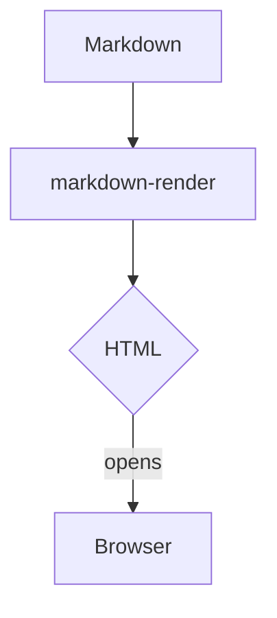

# markdown-render

CLI utility written in TypeScript that converts a Markdown file to styled HTML, writes the result to a temporary location, and opens it in your default browser. The generated page respects the system light, dark, or auto theme through `prefers-color-scheme` aware styles so you get a comfortable reading experience without manual toggles.

## Features

- Built with strict TypeScript for safer refactors and richer editor tooling.
- Uses [`marked`](https://marked.js.org/) for fast, CommonMark-compatible Markdown parsing.
- Launches the default browser cross-platform via [`open`](https://github.com/sindresorhus/open).
- Generates semantic HTML via a Mustache template (`template/document.mustache`) with responsive typography and code-friendly styling that adapts to light or dark mode automatically, with CLI overrides when needed.
- Defaults to a Geist Sans + Geist Mono stack with Tailwind Prose-inspired spacing, with additional presets (including Inter UI) selectable at runtime.
- Renders fenced `mermaid` code blocks as interactive diagrams via Mermaid.js when present.
- Outputs to stdout or skips browser launching for scripting and automated scenarios.

## Installation

### Install globally from npm

```
npm install --global @kennyfrc/markdown-render
```

After installation you can invoke the CLI from any directory.

Both `markdown-render` and the shorter alias `mdr` point to the same executable:

```
mdr README.md --style geist-prose
```

### Run without installing

```
npx @kennyfrc/markdown-render README.md --stdout
```

### Install from source (development)

```
npm install --global .
```

The `prepare` script compiles the TypeScript sources during install and publish so the `dist/` artifacts stay current.

## Usage

```
markdown-render <markdown-file> [options]
mdr <markdown-file> [options]

Options:
  -h, --help            Show usage instructions.
  --no-open             Do not launch the browser after generating HTML.
  --stdout              Print the generated HTML to standard output instead of writing to a temp file.
  --theme <mode>        Force a theme: "light", "dark", or "auto" (default: auto).
  --style <id>          Typography/background preset (default: geist-prose).
  --list-styles         Print available presets and exit.
  --light               Shortcut for "--theme light".
  --dark                Shortcut for "--theme dark".
```

The CLI writes the rendered HTML to a temporary directory such as `~/Library/Caches/TemporaryItems/markdown-render-*` on macOS and opens that file in your default browser. The output path is printed to stdout for reference.

### Styling presets

Presets bundle font imports, color palettes, and background treatments inspired by the Inter and Geist communities plus Tailwind CSS prose defaults.

```
mdr README.md --style geist-prose --theme auto
mdr README.md --style inter-ui --dark --stdout > preview.html
mdr --list-styles
```

Preset styles load fonts from the relevant CDNs (for example Google Fonts for Geist/Inter). When offline, the HTML falls back to system fonts.

### Mermaid diagrams

Code fences labelled `mermaid` are detected automatically and rendered in the browser using Mermaid.js. For example:



<small>Source</small>:

````markdown

````

No extra flags are needed—the CLI injects the Mermaid runtime only when such blocks are present.

### Respecting light and dark mode

The generated HTML includes:

- `<meta name="color-scheme" content="…">` to opt-in to user theme preferences.
- A paired `:root` declaration and conditional overrides using `@media (prefers-color-scheme: dark)` when in auto mode.
- Explicit palette selection when `--theme light` or `--theme dark` is provided, useful for screenshots or presentations that require a fixed appearance.

## Development

- `npm install` – install dependencies and compile TypeScript.
- `npm run build` – compile TypeScript to `dist/` and refresh the Mustache-rendered CLI output.
- `npm run typecheck` – run the TypeScript compiler without emitting files.

## Publishing (maintainers)

1. Ensure you are logged in with publishing rights: `npm login`.
2. Run the checks: `npm run typecheck` and `npm run build`.
3. Bump the version (for example `npm version patch`).
4. Publish to the public registry: `npm publish --access public`.

`npm publish` runs the `prepare` script so the compiled `dist/` output is included automatically. See the [npm publish docs](https://docs.npmjs.com/cli/publish) for more details.

## Testing

Manual smoke checks for now:

- `node dist/markdown-render.js --help` – emits usage instructions.
- `node dist/markdown-render.js README.md --stdout | head` – renders Markdown to HTML without opening the browser.
- `node dist/markdown-render.js README.md --style inter-ui --stdout | grep "fonts.googleapis"` – confirms preset font imports appear in the head.
- `node dist/markdown-render.js README.md --style geist-prose --theme dark --stdout | head` – verifies style and dark-mode overrides.
- `MARKDOWN_RENDER_NO_OPEN=1 node dist/markdown-render.js README.md` – writes HTML to the temp directory while suppressing browser launch (useful in CI).

## Roadmap

- Add automated smoke tests that validate HTML scaffolding.
- Optionally allow custom CSS templates for bespoke styling.
- Support monitoring the Markdown file and live reloading the browser session.
